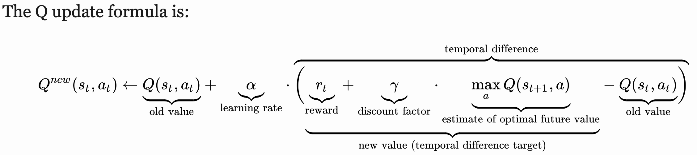
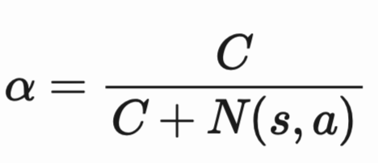
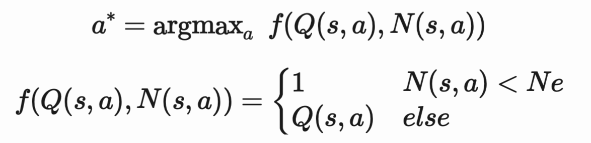

# snake
Snake is a famous video game originated in the 1976 arcade game Blockade. The player uses up, down, left and right to control the snake which grows in length (when it eats the food pellet), with the snake body and walls around the environment being the primary obstacle. 
In this project, I trained an AI agent using temporal difference learning, more specifically the Q-learning algorithm, to play a simple version of the game snake.

# how it works
We can define a MDP (Markov Decision Process) to model the Q-learning agent's movement within the environment.

States: the agent’s internal representation of the environment  
Actions: the possible actions the agent can take in the environment  
Rewards: the numerical representation of the outcome of each action in the environment.  

In Q-learning, instead of explicitly learning a representation for transition probabilities between states, we let the agent observe its environment, choose an action, and obtain some reward.

The Temporal Difference hyperparameter 𝜸 allows us to "discount" future rewards, pushing the snake to obtain food quicker. 
Our learning rate, 𝛼, controls how much our Q estimate should change with each update. 

We now must implement an exploration policy to ensure some balancing between visiting states we haven't seen before and choosing the action with the maximal Q-value. 

An example run of training the Snake with 25000 games:
https://user-images.githubusercontent.com/75760028/146681084-68a85697-54b1-405c-b6ea-1072cf2b0dd9.mov

Running Snake AI with:   python3 main.py --snake_head_x 200 --snake_head_y 200 --food_x 80 --food_y 80 --Ne 40 --C 40 --gamma 0.7 --train_episodes 25000
